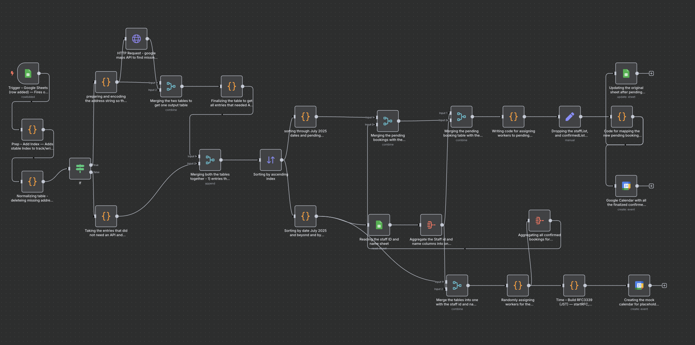

# Tokyo Cleaner Calendar Agent (n8n + Google Sheets/Calendar)

> Automates scheduling: new rows in a Google Sheet → conflict-free Google Calendar events with address enrichment, capacity/rest rules, proximity preference, and write-back.

## What this repo shows
- **End-to-end workflow** turning spreadsheet bookings into **calendar events**.
- **Address enrichment** (Google Maps Geocoding) → consistent `postal_code` + `ward_district`.
- **Scheduling engine** with **max 3 jobs/day**, **no overlaps**, and **1-hour rest buffers**.
- **Proximity** preference (same ward → same postal prefix), **load-balancing**, and fallback logic.
- **Dual calendars**: demo/mock for existing confirmed bookings and final for newly assigned ones.
- **Write-back** to the sheet (`Status = Confirmed`), with guidance for event IDs/links (idempotency).
- **Screenshots** of the workflow and the resulting calendars (proof & visualization).
- **Skills demonstrated**: n8n, Google Sheets/Calendar APIs, HTTP/REST, regex/JS data cleaning,
  scheduling algorithms, RFC 3339 time handling, and production-style documentation.

## Visuals
Here’s the automated workflow for booking, staff assignment, and calendar integration:

## How it works (high-level)
- Google Sheets “row added” **triggers** the workflow.
- **Normalize** and detect if geocoding is needed; **enrich** with Google Maps when ward/postal is missing.
- Build two sets:
  1) **Confirmed ≥ 2025-07-01** → mock calendar for demo/validation.
  2) **Pending ≥ 2025-07-01** → **assign** staff using capacity/rest/proximity.
- Convert to **RFC 3339** (JST +09:00) and **create events**.
- **Write back** to the source sheet (recommended: also eventId + eventLink).

See the detailed diagrams and data contracts in `/docs`.

## Quickstart
1. **Prereqs**: n8n, Google Sheets/Calendar OAuth creds, Google Maps Geocoding API key.
2. **Import** `workflow/tokyo-cleaner-n8n.json` into n8n.  
   *(Replace any placeholder keys with your own.)*
3. Point the Google Sheets/Calendar nodes at your docs/calendars.
4. Add your images to `/assets` (same filenames as above).
5. Run the trigger; verify events appear on both calendars.
6. (Optional) Enable write-back to set `Status=Confirmed` and store event IDs.

## Configuration
| Setting           | Default | Meaning                                   |
|-------------------|---------|-------------------------------------------|
| `DAILY_CAP`       | 3       | max jobs per staff per day                |
| `REST_MINUTES`    | 60      | rest buffer on both sides of a booking    |
| `ALLOWED_IDS`     | 7,32,38 | staff restricted to John/Marjorie/Teresa  |
| `TZ`              | JST     | RFC 3339 timestamps include `+09:00`      |

## Skills I gained
- **Workflow design** in n8n: branching, merges, aggregation, and safe write-back.
- **Data cleaning** with JS (regex, schema normalization, address parsing).
- **API integration** (Google Maps Geocoding; Google Calendar + Sheets).
- **Scheduling algorithms**: capacity limits, gap enforcement, overlap checks, proximity scoring.
- **Time handling**: robust RFC 3339 generation and validation.
- **Operational reliability**: idempotency strategy, conflict flags, troubleshooting playbook.

## Results (highlights)
- Conflict-free schedules with explicit 1-hour rest gaps.
- Proximity-aware assignments keeping workers in the same ward/postal area.
- Even distribution (low variance in daily loads).
- Fast, repeatable processing from spreadsheet to calendar.

## Repo guide
- `/docs` – architecture, flowchart, rules, data contracts, reliability, troubleshooting.
- `/workflow` – the n8n JSON export and credential notes.
- `/examples` – sample CSVs + a tiny RFC 3339 validation script.
- `/images` – add your screenshots here.

## License
MIT – see [LICENSE](LICENSE).
